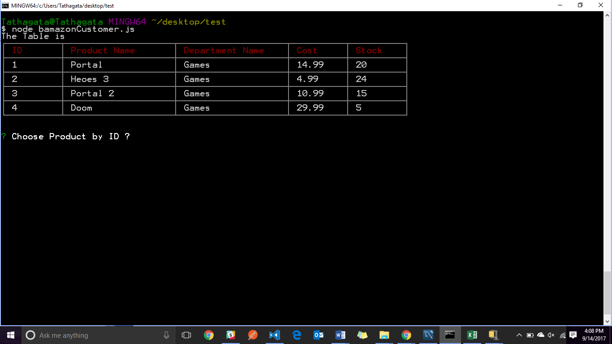
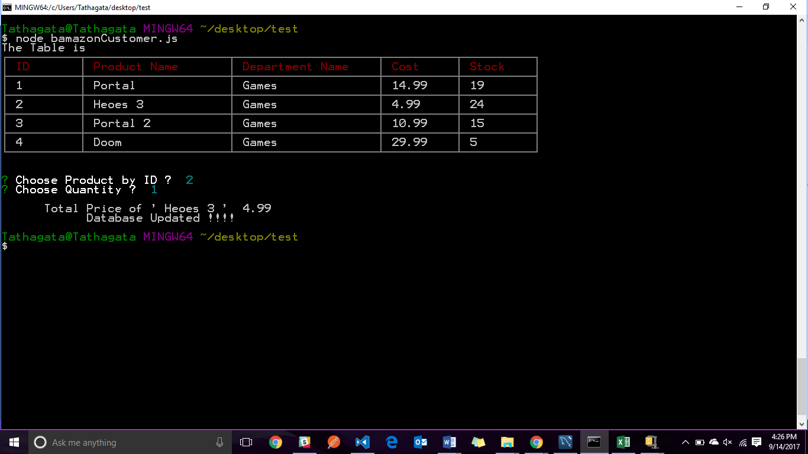
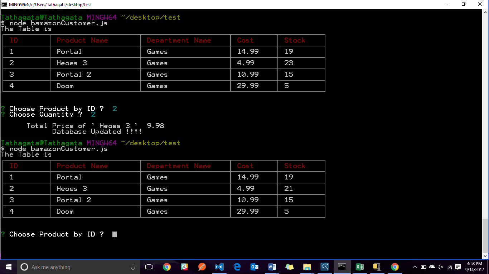

# MySql-App

## Overview
This is a Node JS application and it is using the MySql Database to store data. To run the application users' need to download the bamazoneCustomer.js file and the corresponding Node Modules for this application and connection password for My-SQL database. Basically, this App displays a table of Items that are on Sale and the users can select an item to buy and the quantity. Below, I have attached the pictures which demonstrates the how the app runs on the console. 

### Pic One
In This picture you will see the program running and the app is displaying all the intems in the invntory 

### Pic Two 
In This picture you can see that the program is running and the customer cart.....

### Pic Three
In this picture you can see that the data of the table is updated accoding to the useres request....

